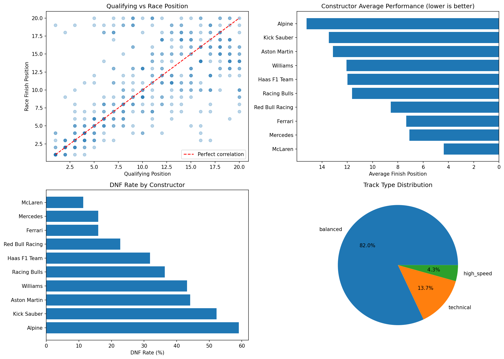
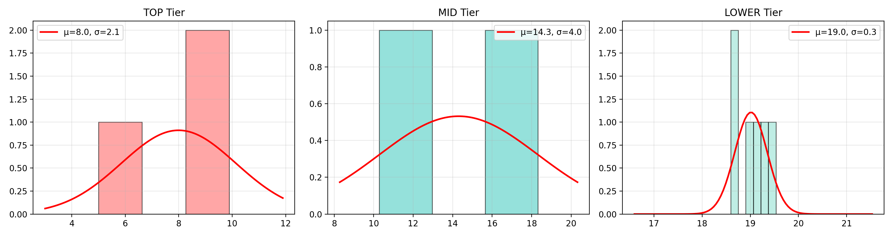
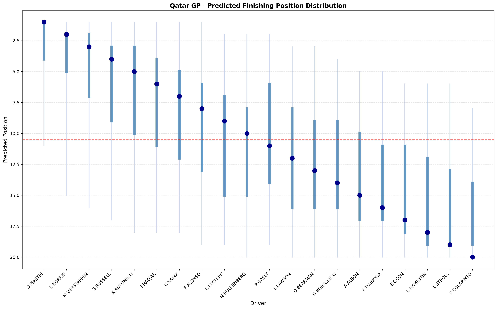
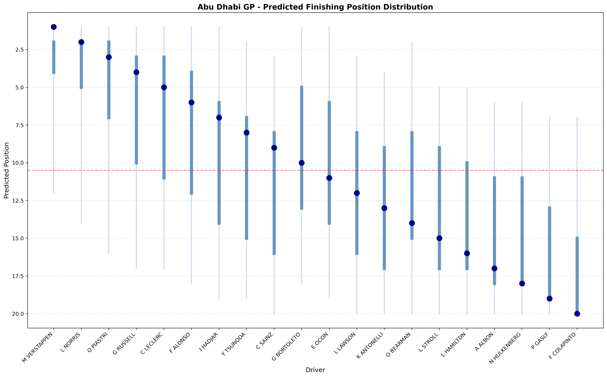

# Formula 1 Race Prediction with Bayesian Simulation

This project predicts Formula 1 race finishing order using FastF1 data, feature engineering, a PyMC hierarchical Bayesian model, and Monte Carlo simulation.

The main idea is simple: a regression-style model can estimate how strong each driver looks, but an F1 race result has to be a valid ranking. There can only be one P1, one P2, and so on. I used the Bayesian model to estimate performance and uncertainty, then used simulation to turn those estimates into realistic 1-20 race rankings.

The best place to read the modeling logic is `F1ModelExplain.ipynb`. The trained model is saved in `model/f1_trace.nc`.

## What This Project Does

- Collects and prepares 2025 F1 race data with FastF1.
- Builds driver, team, track-type, recent-form, and DNF-risk features.
- Trains a hierarchical Bayesian model in PyMC.
- Checks posterior convergence with ArviZ.
- Converts model outputs into valid race rankings through Monte Carlo simulation.
- Evaluates predictions on Qatar GP and Abu Dhabi GP.
- Uses the Abu Dhabi prediction to project the 2025 championship standings.

## Why I Used This Approach

Race prediction has two problems that a basic model does not handle well.

First, drivers are not independent. If one driver finishes first, no other driver can also finish first. Predicting each driver's finishing position separately can produce probabilities that do not make sense as a full race result.

Second, F1 performance is layered. A driver result depends on the driver, the car, the grid position, the circuit type, recent form, and reliability. A hierarchical Bayesian model gives a cleaner way to separate some of these effects while still keeping uncertainty in the final prediction.

## Modeling Setup

For driver `d` in race `r`, the model estimates finishing position as:

```text
y[d,r] ~ Normal(mu[d,r], sigma_race^2)

mu[d,r] =
    alpha
  + beta_team[team[d]]
  + gamma_driver[d]
  + eta_grid * GridPosition[d,r]
  + delta_track[track[r]] * adaptation[d]
  + epsilon_trend * recent_form[d]
  + zeta_dnf * DNF_risk[d]
```

In plain English:

| Term | Meaning |
| --- | --- |
| `alpha` | Baseline finishing position |
| `beta_team` | Team or constructor strength |
| `gamma_driver` | Driver ability after accounting for the car |
| `eta_grid` | Starting grid position effect |
| `delta_track` | Track-type effect for high-speed, balanced, and technical circuits |
| `epsilon_trend` | Recent performance trend |
| `zeta_dnf` | Penalty for DNF risk |
| `sigma_race` | Race noise that the features do not explain |

Lower finishing position is better, so negative effects usually mean stronger performance.

One modeling detail I had to handle carefully: `GridPosition` and `QualifyingPosition` were highly correlated, about `0.974` in the processed data. I avoided relying on both as separate strong signals because that would double-count almost the same information.

## Ranking Simulation

The PyMC model produces continuous predicted finishing scores. Those scores are useful, but they are not yet a race result. To get a valid ranking, I used this process:

1. Sample one set of parameters from the posterior.
2. Generate one latent performance score for each driver.
3. Sort the drivers by that score.
4. Assign unique finishing positions from P1 to P20.
5. Repeat many times.
6. Summarize win probability, podium probability, Top 10 probability, expected position, mode position, and uncertainty intervals.

For the Abu Dhabi GP prediction, the notebook runs 500,000 simulations. The final ranking is sorted by:

```text
Mode -> Mean -> P_Win descending -> Q25 -> CI_2.5
```

## Results

### Model Training

The final model was trained in `F1ModelBuild.ipynb` with 4 chains, 2,000 tuning steps, and 4,000 posterior draws per chain.

| Metric | Result |
| --- | ---: |
| Maximum R-hat | 1.0047 |
| Minimum ESS | 455 |
| Divergences | 0 |
| Posterior predictive R2 | 0.490 |
| Posterior predictive MAE | 3.12 positions |

The convergence diagnostics looked acceptable for the project goal. The model is not perfect, but it gave a usable posterior for simulation and race-level evaluation.

### Qatar GP

| Metric | Result |
| --- | ---: |
| MAE | 3.80 positions |
| RMSE | 4.89 positions |
| Spearman correlation | 0.641 |
| Top 5 hit rate | 4/5 |
| Top 10 hit rate | 8/10 |

The model captured most of the front half of the field, but missed the winner. It predicted `O PIASTRI`, while the actual winner was `M VERSTAPPEN`.

### Abu Dhabi GP

| Metric | Result |
| --- | ---: |
| MAE | 3.10 positions |
| RMSE | 4.40 positions |
| Exact rank predictions | 4/20 |
| Within +/-1 position | 10/20 |
| Top 3 driver-set hit rate | 3/3 |
| Top 10 driver-set hit rate | 6/10 |

Predicted Abu Dhabi GP Top 5:

1. `M VERSTAPPEN`
2. `L NORRIS`
3. `O PIASTRI`
4. `G RUSSELL`
5. `C LECLERC`

The strongest result here was the podium group. The model identified the correct Top 3 drivers, even though exact ordering still had uncertainty.

### Abu Dhabi Detailed Prediction Table

The full detailed output is saved in `result/abu_dhabi_predict_menka.csv`.

| Predicted | Actual | Diff | Driver | Mean | Mode | P Win | P Top 3 | P Top 10 |
| :---: | :---: | ---: | --- | ---: | ---: | ---: | ---: | ---: |
| 1 | 1 | 0 | M VERSTAPPEN | 3.42 | 1 | 24.0% | 63.4% | 96.2% |
| 2 | 3 | -1 | L NORRIS | 4.33 | 1 | 18.6% | 53.2% | 91.9% |
| 3 | 2 | 1 | O PIASTRI | 5.29 | 2 | 14.6% | 43.6% | 86.8% |
| 4 | 5 | -1 | G RUSSELL | 6.28 | 3 | 11.2% | 34.7% | 81.0% |
| 5 | 4 | 1 | C LECLERC | 7.29 | 5 | 8.4% | 26.7% | 74.6% |
| 6 | 6 | 0 | F ALONSO | 8.21 | 5 | 6.2% | 20.1% | 68.2% |
| 7 | 17 | -10 | I HADJAR | 10.29 | 6 | 2.5% | 8.6% | 52.5% |
| 8 | 14 | -6 | Y TSUNODA | 10.82 | 7 | 1.9% | 6.5% | 48.4% |
| 9 | 13 | -4 | C SAINZ | 11.78 | 9 | 1.0% | 3.6% | 40.6% |
| 10 | 11 | -1 | G BORTOLETO | 9.01 | 10 | 4.6% | 15.0% | 62.5% |
| 11 | 7 | 4 | E OCON | 9.70 | 10 | 3.4% | 11.4% | 57.2% |
| 12 | 18 | -6 | L LAWSON | 12.23 | 13 | 0.7% | 2.7% | 37.0% |
| 13 | 15 | -2 | K ANTONELLI | 12.67 | 13 | 0.5% | 1.9% | 33.6% |
| 14 | 12 | 2 | O BEARMAN | 11.32 | 14 | 1.4% | 4.9% | 44.3% |
| 15 | 10 | 5 | L STROLL | 13.10 | 15 | 0.4% | 1.4% | 30.3% |
| 16 | 8 | 8 | L HAMILTON | 13.58 | 18 | 0.3% | 1.0% | 26.8% |
| 17 | 16 | 1 | A ALBON | 14.10 | 19 | 0.2% | 0.6% | 23.2% |
| 18 | 9 | 9 | N HULKENBERG | 14.69 | 20 | 0.1% | 0.4% | 19.5% |
| 19 | 19 | 0 | P GASLY | 15.42 | 20 | 0.0% | 0.2% | 15.3% |
| 20 | 20 | 0 | F COLAPINTO | 16.47 | 20 | 0.0% | 0.1% | 10.1% |

### Championship Projection

Using the Abu Dhabi simulation result, the projected 2025 championship Top 3 were:

| Rank | Driver | Projected Points |
| ---: | --- | ---: |
| 1 | `L NORRIS` | 426 |
| 2 | `M VERSTAPPEN` | 421 |
| 3 | `O PIASTRI` | 407 |

## Visuals

### Data Exploration



This figure shows the relationship between qualifying and race result, average constructor performance, DNF rate by constructor, and the track-type mix in the dataset.

### Team Tier Priors



This figure shows how team tiers were used to guide the team-strength prior. It is a simple prior, but it helps the model start with a reasonable view of the field.

### Qatar GP Position Distribution



The dark points show the final predicted rankings. The vertical ranges show uncertainty from the simulation.

### Abu Dhabi GP Position Distribution



This figure shows the simulated finishing range for each Abu Dhabi GP driver.

## Repository Structure

```text
.
|-- README.md
|-- F1DataGet.ipynb
|-- F1ModelBuild.ipynb
|-- F1ModelExplain.ipynb
|-- F1MTKL.ipynb
|-- F1 Predict Qatar.ipynb
|-- F1 Predict ABU DHABI.ipynb
|-- test.py
|-- data/
|   |-- f1_multi_season_results.csv
|   |-- f1_race_data_cleaned.csv
|   |-- driver_features.csv
|   |-- drivers_info.csv
|   |-- teams_info.csv
|   |-- qatar_ready.csv
|   |-- abu_dhabi_ready.csv
|   `-- legacy/
|-- model/
|   `-- f1_trace.nc
|-- result/
|   |-- qatar_predict.csv
|   |-- qatar_predict_menka.csv
|   |-- qatar_final_menka.csv
|   |-- qatar_final_prediction_top1.csv
|   |-- qatar_final_prediction_top5.csv
|   |-- qatar_final_prediction_top10.csv
|   |-- qatar_final_prediction_balanced.csv
|   |-- abu_dhabi_predict_menka.csv
|   |-- final_2025_championship_prediction.csv
|   |-- final_2025_championship_with_team_orders.csv
|   |-- historical_predictions.csv
|   |-- historical_predictions/
|   |-- optimal_fusion_weights.csv
|   |-- qatar_prediction_comparison.csv
|   |-- driver_strategy_comparison.csv
|   `-- strategy_summary.csv
|-- assets/
|   |-- f1_data_exploration.png
|   |-- team_tiers.png
|   |-- qatar_position_distribution.png
|   |-- abu_dhabi_position_distribution.png
|   |-- qatar_prediction_evaluation.png
|   `-- strategy_comparison.png
`-- archive/
    `-- legacy_notebooks/
```

## Main Notebooks

| Notebook | Purpose |
| --- | --- |
| `F1DataGet.ipynb` | Pulls race data with FastF1 and builds the base dataset. |
| `F1ModelBuild.ipynb` | Trains the final PyMC model and saves the posterior trace. |
| `F1ModelExplain.ipynb` | Explains the model, priors, diagnostics, and final results. |
| `F1MTKL.ipynb` | Tests ranking logic, strategy weighting, and Qatar validation. |
| `F1 Predict Qatar.ipynb` | Runs and evaluates Qatar GP predictions. |
| `F1 Predict ABU DHABI.ipynb` | Runs Abu Dhabi GP predictions and championship projection. |

Earlier experiments are preserved under `archive/legacy_notebooks/` so the root folder only contains the notebooks used by the current workflow.

## Data Artifacts

| File | Description |
| --- | --- |
| `data/f1_multi_season_results.csv` | Aggregated FastF1 race-level data. |
| `data/f1_race_data_cleaned.csv` | Cleaned model-ready race data. |
| `data/driver_features.csv` | Driver-level features, including points, average position, recent form, track-type averages, and DNF rate. |
| `data/drivers_info.csv` | Driver standings and current team information. |
| `data/teams_info.csv` | Constructor points, rank, and tier information. |
| `data/qatar_ready.csv` | Qatar GP prediction input. |
| `data/abu_dhabi_ready.csv` | Abu Dhabi GP prediction input. |
| `data/legacy/` | Older root-level data artifacts kept for reference, not used by the current main pipeline. |
| `model/f1_trace.nc` | Saved ArviZ NetCDF posterior trace. |

## Result Artifacts

| File | Description |
| --- | --- |
| `result/qatar_predict_menka.csv` | Qatar GP simulation output. |
| `result/qatar_final_menka.csv` | Final Qatar GP ranking output. |
| `result/qatar_final_prediction_top1.csv` | Qatar ranking after Top 1 strategy weighting. |
| `result/qatar_final_prediction_top5.csv` | Qatar ranking after Top 5 strategy weighting. |
| `result/qatar_final_prediction_top10.csv` | Qatar ranking after Top 10 strategy weighting. |
| `result/qatar_final_prediction_balanced.csv` | Qatar ranking after balanced strategy weighting. |
| `result/qatar_prediction_comparison.csv` | Qatar prediction versus actual result comparison. |
| `result/abu_dhabi_predict_menka.csv` | Abu Dhabi GP simulation output. |
| `result/final_2025_championship_prediction.csv` | 2025 championship projection using Abu Dhabi prediction. |
| `result/final_2025_championship_with_team_orders.csv` | Championship projection after the team-orders scenario. |
| `result/historical_predictions.csv` | Historical validation predictions used by `F1MTKL.ipynb`. |
| `result/historical_predictions/all_historical_predictions.csv` | Per-race historical prediction rollup. |
| `result/optimal_fusion_weights.csv` | Optimized strategy weights from historical validation. |
| `result/driver_strategy_comparison.csv` | Driver-level comparison across Qatar strategy variants. |
| `result/strategy_summary.csv` | Summary metrics for Qatar strategy variants. |

## Figure Artifacts

| File | Description |
| --- | --- |
| `assets/f1_data_exploration.png` | Data exploration summary chart. |
| `assets/team_tiers.png` | Constructor tier prior visualization. |
| `assets/qatar_position_distribution.png` | Qatar predicted finishing-position distribution. |
| `assets/abu_dhabi_position_distribution.png` | Abu Dhabi predicted finishing-position distribution. |
| `assets/qatar_prediction_evaluation.png` | Qatar prediction evaluation chart. |
| `assets/strategy_comparison.png` | Strategy comparison chart from `F1MTKL.ipynb`. |

## How to Run

Run notebooks from the project root so relative paths resolve correctly.

Install dependencies:

```bash
conda activate base
pip install fastf1 pandas numpy scipy matplotlib seaborn pymc arviz scikit-learn tqdm joblib jupyter
```

Start Jupyter:

```bash
jupyter notebook
```

Recommended order:

1. `F1DataGet.ipynb`
2. `F1ModelBuild.ipynb`
3. `F1ModelExplain.ipynb`
4. `F1 Predict Qatar.ipynb`
5. `F1 Predict ABU DHABI.ipynb`
6. `F1MTKL.ipynb`

If you only want to review the completed work, start with `F1ModelExplain.ipynb` and use the saved trace in `model/f1_trace.nc`.

Generated FastF1 cache files are written to `data/f1_cache/` and ignored by git.

## What I Would Improve Next

- Add lap-level pace and tire strategy instead of relying mostly on race-level features.
- Include weather, safety cars, penalties, pit stops, and tire degradation.
- Model constructor-season effects more explicitly.
- Test the model on more seasons to reduce overfitting to one season's field.
- Build a small dashboard where users can change grid order and simulate a race live.

## Main Takeaway

The model is strongest at identifying front-of-field and Top 10 drivers, while exact ranking in the midfield is still noisy. That matches the nature of F1: the front runners are more stable, while the midfield is more sensitive to incidents, strategy, and small race-day changes.

The useful part of this project is not just the final ranking. It is the full workflow: data collection, feature design, Bayesian modeling, convergence checks, simulation under ranking constraints, and honest evaluation against actual race results.
